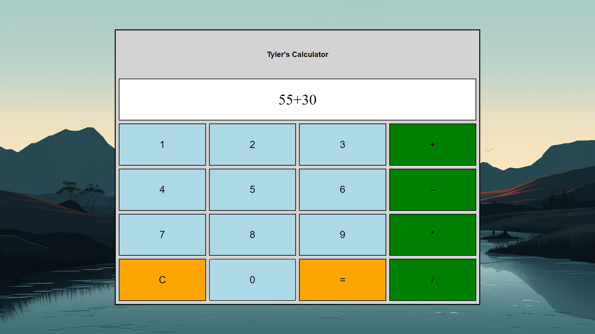

# Calculator

This is a simple calculator web application built using HTML, CSS, and JavaScript. It allows users to perform basic arithmetic operations.

## Features

- Responsive design with a grid layout
- Buttons for numbers (0-9) and operators (+, -, *, /)
- Clear button (C) to reset the input
- Equals button (=) to evaluate the expression
- Error handling for invalid expressions

## Getting Started

To use the calculator, simply open the `calculator.html` file in a web browser. The calculator interface will be displayed, and you can start entering numbers and performing calculations.

## Customization

If you want to customize the calculator's appearance, you can modify the CSS styles in the `<style>` section of the HTML file. You can change the colors, fonts, and dimensions to match your preferences.

##P Preview

